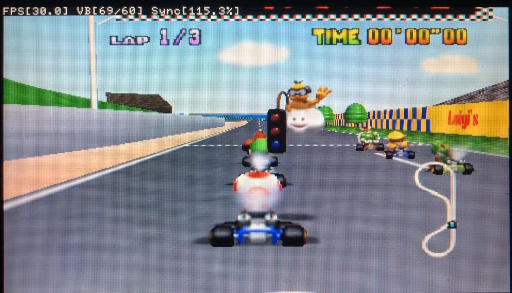

# DaedalusX64

<h1 align="center">
    <a href="https://github.com/DaedalusX64/Daedalus" target="_blank">
        <br>
</h1>


[](https://discord.gg/FrVTpBV)
<a href="https://github.com/DaedalusX64/daedalus/releases" alt="Release: 1.1.8"></a>
[](pic/Language.png)
[](https://github.com/DaedalusX64/daedalus/issues)
[](https://github.com/DaedalusX64/daedalus/stargazers)
[](https://github.com/DaedalusX64/daedalus/network/members)
<a href="https://github.com/DaedalusX64/daedalus/blob/master/copying.txt" alt="License: GPLv2"></a>

 
<b><u>DaedalusX64</u></b> is a free and open-source Nintendo 64 emulator for Windows, Mac, Linux, PSP, PSVita, PS2 and 3DS with plans to port to among other platforms. Written in C++. It supports most games and has high compatibility.


## Platforms

| Consoles                       | Available               | Latest Version |
| ------------------------------- | ---------------------------- | --------------------- |
| [](https://github.com/DaedalusX64/daedalus)                          | ✓                       | 1.1.8 |
| [](https://github.com/Rinnegatamante/DaedalusX64-vitaGL)                 | ✓              | 0.6 |
| [](https://github.com/belek666/daedalus)                         | ✓        | 1.1.8 r2 |
| [](https://github.com/masterfeizz/DaedalusX64-3DS)                              | ✓                  | Beta 0.2 |
|                               | !               | ! |
|                               | !                | ! |
|                        | !                   | ! |
 
## Features
 
- Fast emulation
- High compatibility
- Support for PSP TV Mode with 480p output!
- Active support and updates
- Lots of experimental optimizations
- Working savestates
- ARM DynaRec
- Audio support (synchronous and asynchronous)
- Rumble Pak support and Controller Pak support
- Multilanguage support
- [Cheats](Data/Daedalus.cht) Support
- Several more features
 
And many more!

## Screenshots




## Compatibility

DaedalusX64 is a High Compatibility Emulator.

[PSP Compatibility List](https://github.com/DaedalusX64/compatibility-list/issues) + 
[DaedalusX64.github.io](https://Daedalusx64.github.io)

- Some roms won't boots.
- Some roms have serious graphical glitches.
- Some roms have random lockups and crashes, or run slowly.
- [SD2DEX](https://github.com/rdx-O/daedalus/blob/3e855a6e458c9c9908dea715aa222ca22bd22a85/Data/S2DEX%20game%20list.txt) Games List
 
## Usage

Install DaedalusX64 to your PSP, download the latest release from the Releases page: 

<h1 align="center">
    <a href="https://github.com/DaedalusX64/daedalus/releases/download/1.1.8/DaedalusX64_1_1_8.zip" target="_blank">
        </br>
</h1>

##### Next,

Download and Unzip `DaedalusX64.zip` file into `/PSP/GAME/` folder on the memory stick. Place your ROM files in `DaedalusX64/Roms/` and they will automatically appear in Daedalus.

**Main Menu**

When you first run *DaedalusX64* you will be presented with a nice list of your
games. To select a game you will press `D-Pad left/right` then `X` to select a
title, there's various options you can choose from in the menu, every option is
explained. To cycle through options screens use the left and right shoulder
buttons.
 
**Note** : If the release is a .zip file with a folder containing an `EBOOT.PBP` file when extracted, simply drag and drop the extracted folder into `/PSP/GAME/`.
DaedalusX64 supports most rom formats ```.v64```, ```.z64```, ```.rom```

## Controls

Default controls :

| N64                             | PSP                                   |
| ------------------------------- | ---------------------------- |
| Start                           | Start                        |
| Analogue Stick                  | Analogue Stick               |
| Dpad                            | ○ (Circle) +  Dpad          |
| A                               | Ｘ (Cross)                   |
| B                               | □ (Square)                  |
| Z                               | △ (Triangle)                |
| L Trigger                       | L Trigger                    |
| R Trigger                       | R Trigger                    |
| C buttons                       | Dpad (Circle unpressed)      |
| Menu                            | Home                         |  

## Building for Windows 

1) Clone and open the repo in Visual studio 2019

2) Build All

## Building for Linux and Mac

1) Clone this repo 

2) Open a terminal and run `build_daedalus.sh` with the argument for the os you would like to build for 
Example: ```./build_daedalus.sh MAC```

## Optimal Settings

<Details>

### :: Preferences ::


**Texture Update Check** : Every Frame (This makes sure the game's textures runs smoothly and that no visual glitches occur, may want to disable for more fps but significant drop in quality)

**Frameskip** : Disabled (Most games run fine with this disabled. If you do need to enable it, it will make the game more choppy but will grant you an FPS boost)

**Zoom** : 100% (Not much explanation needed)

**Limited Framerate** : Full speed (This will make sure that your FPS is not limited so that you can get the maximum FPS you can)

**Dynamic Recompilation** : Enabled (This makes the system recompile some part of a program during execution, making the emulator more efficient and optimised)

**High level Emulation** : Enabled (Optimises the game even more)

**Audio** : Synchronous (Some games may just have bad/laggy audio so you might want to turn this off if the audio is still choppy)

**Controller** : Default (Unless you have a custom layout in which you should use that)

### :: Advanced Options ::

**Dynarec Memory Optimisation** : Enabled

**Dynarec Loop Optimisation** : Enabled (NOTE: Very unstable - if your game has crashes, this is probably why)

**Dynarec Doubles Optimisation** : Enabled

**Clean Scene** : Disabled

**Clear N64 Depth Buffer** : Disabled

**Double Display Lists** : Enabled

**Video Rate Match** : Yes

**Audio Rate Match** : No

**Fog Emulation** : Disabled

**NOTE** : When the sound is activated, the emulation speed tends to decrease and the game has errors, which is why it is deactivated.

Here we put the **Previews** of most of the Nintendo 64 games, simply download this link and the `Resources` folder of the download, place it inside your emulator.

</Details>

## Changes History

<Details>

**1.1.8**

* New graphical interface and small images of the covers of the games have been added, which work properly with large lists of roms.
* Changes have been made to asynchronous audio making the use of the PSP's Media Engine more stable .
* The PRX in charge of the Media Engine processes has been updated , improving its performance.
* Now you have a new logo and background image the EBOOT.PBP.
* Added a new speed hack that improves the performance of some games.
* Now it detects if the emulator is running on a PS Vita.
* The code has been updated to the C ++ 11 standard .
* General code cleaning

**1.1.7**

* New UI and small preview images: Working properly with large ROM lists
* Changes to Asynchronous audio: No longer waits for the Media Engine CPU to complete the last job and run on the main PSP CPU!
* New EBOOT logo and PIC1
* Rebased with the latest version from strmnnrmn
* C11 Standard variables
* General code cleanup and more!

Wally4000 : New UI, Code cleanup, Re-basing
MotoLegacy : New icons
z2442 : ME work, Code cleanup

**1.1.6**

* Updated our toolchain which was provided by top-sekret, this provides GCC 8 and oddly has improved performance of Daedalus
* Make some changes to the job manager to improve audio performance, Audio is very stable now.
* Enable more fast memory copying

**1.1.5**

* Move to a modern make system - Daedalus was left in 2009 with gyp as it's main compiler but that lead to trouble and the PSP build did not work with that. I've moved all the source files and managed to get it compiing in CMake which to me is by far a more flexible system than gyp. This will allow us to finally start to look at making the macOS / Linux and Windows versions working again.
If you've built the source in the past. (Not sure if StrmnNrmn would approve but like make did to him, gyp makes me want to tear my eyes out. :P
There are still some things that need to be moved, like the PSP PRX sources but that can wait as it's not important.
* Clean up the Source - Still work in progress but is happening as there appear to be other projects in the pipeline. The source has lost some weight and likely will continue to do so until it's nice and clean

**1.1.4**

* improved stability and performance
* minor changes to the dynarec
* updated some UI aspects to remove graphical bugs

-Notes
* If using a ps vita please delete the MediaEngine.prx form the DaedalusX64 folder. This will prevent issues when running audio in async mode. The vita does not have and does not emulation the psps co processor.
* Preview images have been removed from the binary file since it is to large to for github. If you would like them please down load them from this repo and place them in \DaedalusX64\Resources\Preview

**1.1.3**

* Further improvements to code optimization including more efficient maths and faster code for the Media Engine bring even further performance improvements.

**1.1.2**

* This release has been updated to compile on the latest PSP SDK. Minor changes to the code and makefile.

**1.1.1**

* Compiled with a small makefile change.

</Details>

## More Information
 
###### [DaedalusX64/Wiki](https://github.com/DaedalusX64/daedalus/wiki) Check *DaedalusX64* ports page for other consoles with information.


<h6>Join our Discord server to talk to other Daedalus users and the developers!</h6>
<h1 align="center">
    <a href="https://discord.gg/FrVTpBV" target="_blank">
        <br>
    <a href="https://discord.gg/YTwTRy2" target="_blank">
        <br>
</h1>
<p align="center">
 
## Credits

|        |                                                            |
| ----------------- | ---------------------------------------------------------- |
| **kreationz, salvy6735, Corn, Chilly Willy**       | Original DaedalusX64 code     |
| **Wally4000**             | Optimizations, improvements and ports |
| **z2442** | Compilation improvements and updating, optimizations|
| **mrneo240** | Optimizations, compilation help |
| **TheMrIron2** | Optimizations, wiki maintenance |
| **MotoLegacy** | Help on Icon and improvements |

Thank you for everyone who has supported us along the way. The realise would not have been possible without your help!.
